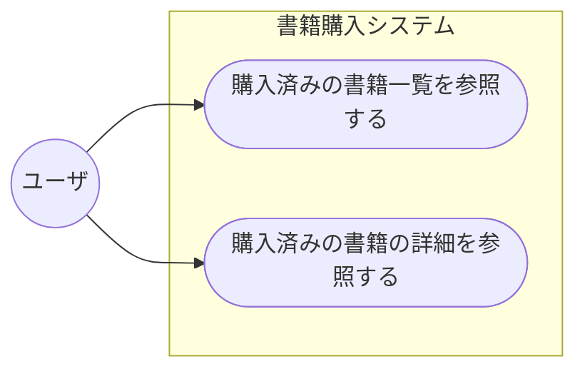

# 書籍管理システム

## 概要

書籍管理システムは、企業の購入済み書籍を管理・参照するための Web アプリケーションです。

**技術スタック**: Node.js + Express + SQLite3 + Vue.js

**提供機能**:
- 📖 購入済み書籍一覧の参照（ページング対応、10件/ページ）
- 📄 書籍詳細情報の参照
- 🖼️ Google Books API を使用したサムネイル画像表示

---

## クイックスタート

### 前提条件
- Node.js v14+ インストール済み
- npm インストール済み

### セットアップ手順

1. **リポジトリをクローン**
   ```bash
   git clone https://github.com/your-org/libre_copilot.git
   cd libre_copilot
   ```

2. **依存パッケージをインストール**
   ```bash
   npm install
   ```

3. **環境変数を設定**
   ```bash
   # .env ファイルを編集
   cp .env .env.local  # (または vi .env)
   ```
   `.env` に以下を設定:
   ```
   PORT=3000
   DB_PATH=./data/booklist.sqlite3
   GOOGLE_BOOKS_API_KEY=your_api_key_here
   ```

   > **Google Books API キー の取得**:
   > 1. [Google Cloud Console](https://console.cloud.google.com/) にアクセス
   > 2. 新規プロジェクトを作成
   > 3. Books API を有効化
   > 4. API キーを取得（無料プラン）

4. **サーバを起動**
   ```bash
   npm start
   ```

5. **ブラウザでアクセス**
   - 一覧画面: http://localhost:3000/booklist.html
   - またはトップURL: http://localhost:3000/ (自動的に一覧画面にリダイレクト)

---

## 仕様

サンプルシステム2として「書籍管理システム」の以下の機能を実装する。

ユースケース図：


### 画面仕様

- [一覧画面](./public/booklist.html) - Vue.js で動的化済み
- [詳細画面](./public/bookdetail.html) - Vue.js で動的化済み

### 機能仕様

- [サンプルシステム2 仕様書](./docs/requirement_samplesystem2.md)
- [実装計画書](./docs/project_plan.md)

---

## REST API ドキュメント

### 一覧画面用 API

**リクエスト**:
```
GET /api/books?page=1&pageSize=10
```

**レスポンス**:
```json
{
  "total": 283,
  "page": 1,
  "pageSize": 10,
  "totalPages": 29,
  "hasNextPage": true,
  "hasPrevPage": false,
  "books": [
    {
      "id": "4838",
      "branch": "0",
      "isbn": "978-4-798-11967-0",
      "title": "SQL Server 2008（試験番号:70-432）",
      "subtitle": "マイクロソフト認定技術資格試験学習書 MCP教科書",
      "writer": "沖 要知",
      "print": "（株）翔泳社",
      "recorddate": "2009/7/15",
      "emp_no": "10074",
      "buy": "紀伊国屋",
      "price": "3511",
      "thumbnailUrl": "https://books.google.com/books/content?..."
    },
    ...
  ]
}
```

### 詳細画面用 API

**リクエスト**:
```
GET /api/books/:id/:branch
```

例: `GET /api/books/4838/0`

**レスポンス**:
```json
{
  "id": "4838",
  "branch": "0",
  "isbn": "978-4-798-11967-0",
  "title": "SQL Server 2008（試験番号:70-432）",
  "subtitle": "マイクロソフト認定技術資格試験学習書 MCP教科書",
  "writer": "沖 要知",
  "print": "（株）翔泳社",
  "recorddate": "2009/7/15",
  "emp_no": "10074",
  "buy": "紀伊国屋",
  "price": "3511",
  "thumbnailUrl": "https://books.google.com/books/content?..."
}
```

### ヘルスチェック API

**リクエスト**:
```
GET /health
```

**レスポンス**:
```json
{
  "status": "ok",
  "timestamp": "2026-04-30T22:51:32.000Z"
}
```

---

## ディレクトリ・ファイル構成

| ディレクトリ名・ファイル名 | 内容 |
|:--|:--|
| `app/` | **バックエンド ソースコード** |
| `app/server.js` | Express サーバ メインファイル |
| `app/db.js` | SQLite3 接続ラッパー |
| `app/services/` | ビジネスロジック層 |
| `app/services/bookService.js` | 書籍データ取得ロジック |
| `app/services/googleBooksService.js` | Google Books API 統合 |
| `app/routes/` | REST API ルーティング |
| `app/routes/api.js` | API エンドポイント定義 |
| `docs/` | ドキュメントディレクトリ |
| `docs/requirement_samplesystem2.md` | サンプルシステム2 仕様 |
| `docs/project_plan.md` | 実装計画書 |
| `data/` | データディレクトリ |
| `data/booklist.sqlite3` | SQLite3 書籍管理システムデータベースファイル |
| `data/books.csv` | books テーブル データ |
| `data/orders.csv` | orders テーブル データ |
| `data/employees.csv` | employees テーブル データ |
| `public/` | **フロントエンド 静的ファイル** |
| `public/booklist.html` | 一覧画面（Vue.js 動的化済み） |
| `public/bookdetail.html` | 詳細画面（Vue.js 動的化済み） |
| `public/css/` | CSSファイル配置ディレクトリ |
| `public/css/booklist.css` | 一覧・詳細画面共通スタイルシート |
| `public/css/bookdetail.css` | 詳細画面追加スタイルシート |
| `public/image/` | 画像ファイル配置ディレクトリ |
| `public/image/20200501_noimage.png` | サムネイル画像なし時の代替画像 |
| `public/image/curve12.png` | トップへ矢印アイコン |
| `public/image/stripe.png` | ストライプ背景パターン |
| `package.json` | Node.js 依存パッケージ定義 |
| `.env` | 環境変数設定ファイル |
| `.gitignore` | Git 除外ファイル設定 |
| `README.md` | このファイル |

---

## トラブルシューティング

### エラー: "Cannot find module 'express'"
```bash
npm install
```

### エラー: "SQLITE_CANTOPEN: unable to open database file"
- `data/booklist.sqlite3` ファイルの存在確認
- ファイルパスの確認（`.env` の `DB_PATH`）

### Google Books API が動作しない
- `.env` に `GOOGLE_BOOKS_API_KEY` を設定済み確認
- API キーが正しいか確認
- 1 日 1,000 回の呼び出し制限を超えていないか確認

### ポート 3000 が既に使用されている
```bash
# 別のポートで起動
PORT=3001 npm start
```

---

## 開発

### 開発サーバの起動（nodemon 使用）
```bash
npm run dev
```

### テストの実行
```bash
npm test
```

---

## ライセンス

MIT

---

## サポート

問題が発生した場合は、GitHub Issues に報告してください。

---

## 仕様

サンプルシステム2として「書籍管理システム」の以下の機能を実装する。

ユースケース図：



### 画面仕様

- [一覧画面（ダミーデータ）](./public/booklist.html)
- [一覧画面（ダミーデータ）](./public/booklist.html)

### 機能仕様

- [サンプルシステム2 仕様](./docs/requirement_samplesystem2.md)


## ディレクトリ・ファイル構成

以下のファイルを使用して実装する。

| ディレクトリ名・ファイル名 | 内容 |
|:--|:--|
| `docs/` | ドキュメントディレクトリ |
| `docs/requirement_samplesystem2.md` | サンプルシステム2(書籍管理システム)の仕様 |
| `docs/how_to_setup_sqlite3_for_samplesystem2.pdf` | サンプルシステム2(書籍管理システム)のDBをSQLite3を使ってセットアップする手順 |
| `data/` | データディレクトリ |
| `data/booklist.sqlite3` | SQLite3 書籍管理システムデータ格納済みデータベースファイル |
| `data/books.csv` | CSV/UTF-8形式の books テーブルデータファイル |
| `data/orders.csv` | CSV/UTF-8形式の orders テーブルデータファイル |
| `data/employees.csv` | CSV/UTF-8形式の employees テーブルデータファイル |
| `public/` | 静的ファイル配置ディレクトリ |
| `public/booklist.html` | 一覧画面（ダミーデータ） |
| `public/bookdetail.html` | 詳細画面（ダミーデータ） |
| `public/css/` | CSSファイル配置ディレクトリ |
| `public/css/booklist.css` | 一覧画面用スタイルシート |
| `public/css/bookdetail.css` | 詳細画面用スタイルシート |
| `public/image/` | 画像ファイル配置ディレクトリ |
| `public/image/20220501_noimage.png` | イメージなし画像データ(フリー素材) |
| `public/image/curve12.png` | トップへ矢印アイコン画像データ |
| `public/image/stripe.png` | ストライプ背景用画像データ |
| `README.md` | このファイル |


